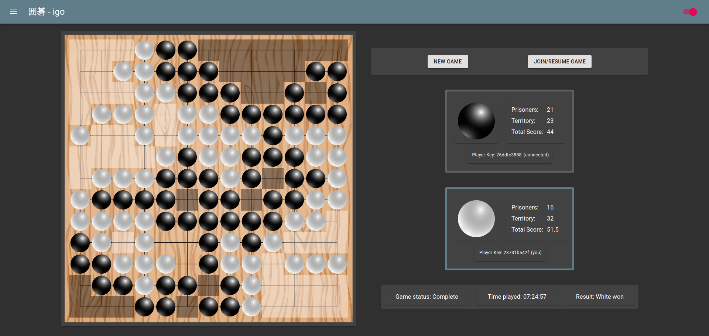

# igo

A long time ago, I took a software engineering course wherein I was part of a
team of students whose chosen course project was to design and implement an
[igo](<https://en.wikipedia.org/wiki/Go_(game)>) (囲碁, go) application. I was
in charge of the core game code (rules and play), and I was the only one who
finished in time, so all we had working by the end was an unnetworked command
line application instead of the shiny-graphic'ed, fully-networked, AI-capable
program we had designed. We still got a good grade, probably because we had
done a good job in the design phase (which was really the point of the class)
and learned a healthy lesson about [Hhofstadter's
law](https://en.wikipedia.org/wiki/Hofstadter%27s_law).

Years later, I decided to finish the job as a hobby project. The fruits of this
effort as undertaken by a mature engineer can be played
[here](https://playigo.herokuapp.com). Note that hosting is on the
[heroku](heroku.com) [free
tier](https://devcenter.heroku.com/articles/free-dyno-hours), so the web server
may take a few moments to come up if it has been sleeping. It should thereafter
be responsive until there is no activity for 30 minutes, at which point it will
sleep again.

For code details and installation, check out the [frontend](frontend/README.md)
and [backend](backend/README.md).
